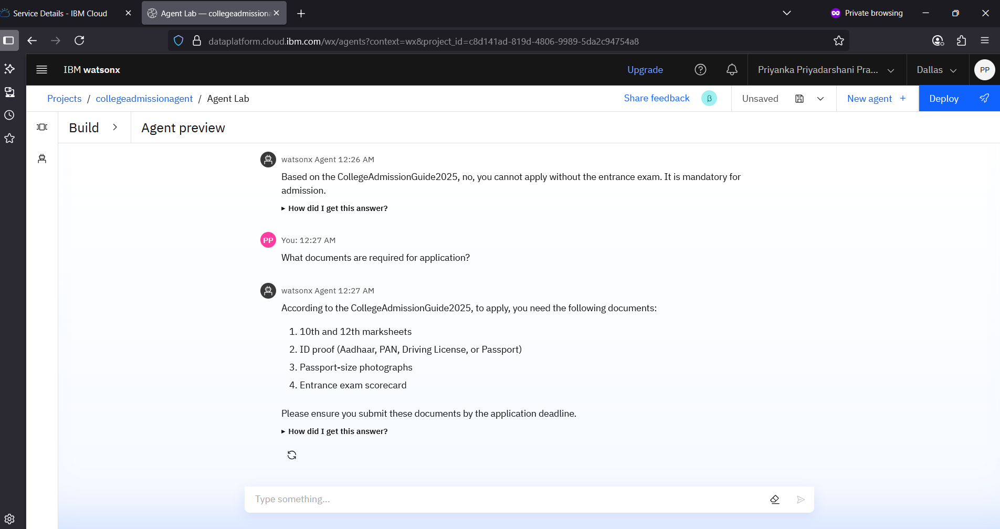
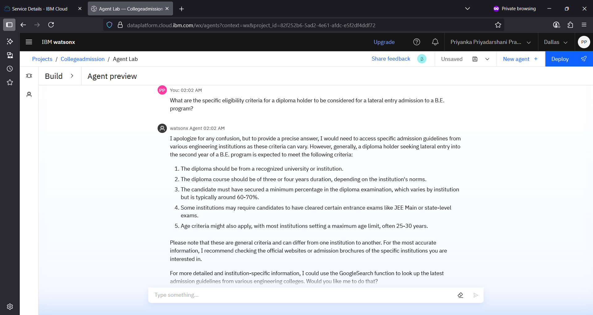
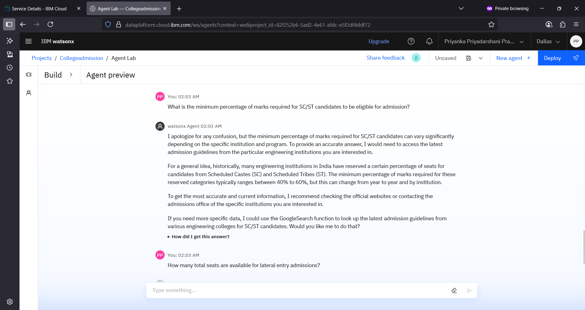
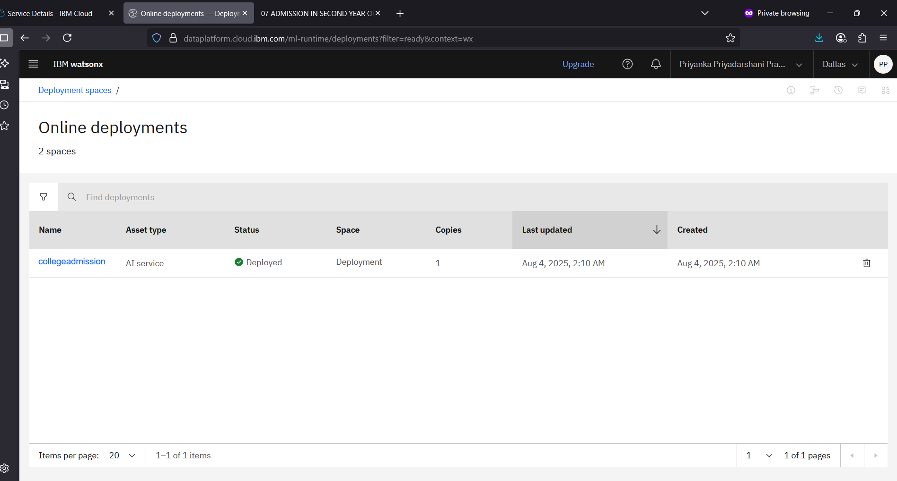
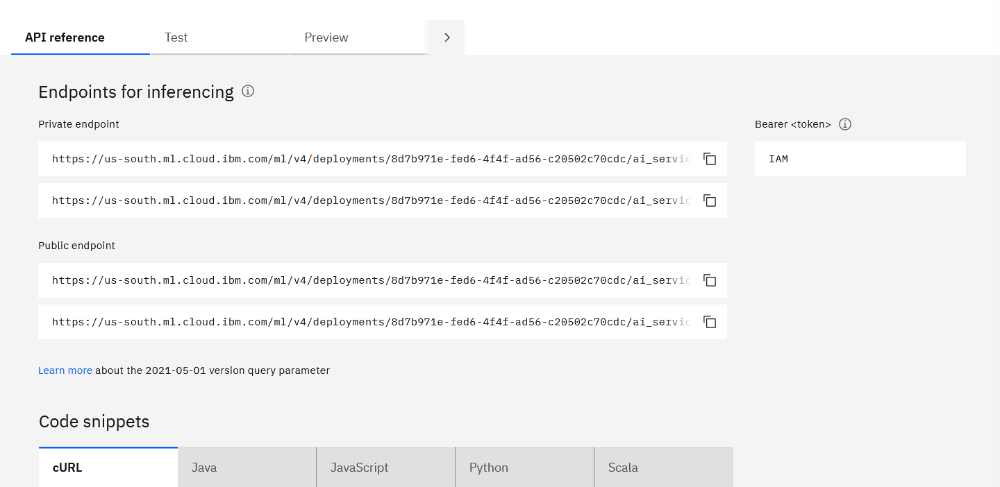

# College-Admission-Agent
An AI-powered RAG-based College Admission Assistant using IBM Cloud and Granite LLM
# 🎓 College Admission Agent  

An AI-powered **College Admission Agent** built using **Retrieval-Augmented Generation (RAG)** on **IBM Cloud Lite (Free Tier)**. This no-code solution provides instant, accurate answers to student queries by retrieving real-time information from institutional documents — simplifying admissions and enhancing transparency.

---

## 📌 Problem Statement

Prospective students often struggle to find clear, accurate, and up-to-date information about college admissions. Important details on eligibility, courses, fees, deadlines, and application processes are spread across websites, PDFs, and FAQs — making it hard to access quickly.

### ✅ Proposed Solution
A **College Admission Agent** powered by **Retrieval-Augmented Generation (RAG)** that:
- Answers natural language questions instantly
- Retrieves real-time data from official sources (PDFs, policies, FAQs)
- Provides guidance on course selection, requirements, fees, and deadlines
- Built on **IBM Cloud Lite** using **IBM Granite LLM**

This AI agent improves accessibility, reduces manual inquiries, and enhances the applicant experience.

---

## 🛠️ Technology Used

### Core Technologies
- **IBM Cloud Lite Services** – Free-tier cloud platform for hosting
- **Natural Language Processing (NLP)** – Understands and processes user queries
- **Retrieval-Augmented Generation (RAG)** – Retrieves facts from documents before generating answers
- **IBM Granite Model** – Foundation LLM for accurate, trusted responses

### IBM Cloud Services Used
 - **IBM Cloud Watsonx AI Studio** - Build and train the AI agent
 - **IBM Cloud Watsonx AI Runtime** - Run the agent with Granite LLM 
 - **IBM Cloud Agent Lab** - No-code interface to create chatbot 
 - **IBM Granite Foundation Model** 
 - **IBM Cloud Object Storage** 
 - **IBM IAM (Identity & Access Management)** - Secure access control 

---

## 🌟 Wow Factors

✅ **Interactive chatbot** for real-time admission guidance  
✅ **Accurate responses** using uploaded policy documents  
✅ **No-code development** via **Watsonx Agent Lab**  
✅ Runs **100% on IBM Cloud Lite (Free Tier)** – zero cost  
✅ **Scalable & customizable** for any college or program  
✅ Enhances **transparency** and **accessibility** in admissions  

---

## 👥 End Users

- 🔹 B.Tech Aspirants
- 🔹 Diploma Holders
- 🔹 Parents and Guardians
- 🔹 College Admission Staff
- 🔹 Educational Institutions

---

## 📊 Results

✅ Successfully deployed a working **AI admission agent**  
✅ Integrated real admission documents (PDFs, FAQs)  
✅ Tested with real user queries (eligibility, fees, deadlines)  
✅ Agent retrieves correct answers from source documents  
✅ Fully functional on **IBM Cloud Free Tier**

The College Admission Agent has been successfully deployed and is fully functional on **IBM Cloud Lite (Free Tier)**.

*The AI agent is live and responding to user queries about admissions, courses, fees, and deadlines — powered by IBM watsonx and Retrieval-Augmented Generation (RAG).*

*API endpoint configuration in IBM watsonx.ai for integrating the College Admission Agent with external applications.*

---

## 🚀 Future Scope

- 🌍 **Multilingual Admission Support** 
- 🎙️ **Voice-Activated Query Handling**
- 🔁 **Real-Time Updates from University Portals**
- 🎯 **Personalized Course & College Recommendations**
- 🔄 **Integration with Application Submission Platforms**
- ✅ **AI-Based Eligibility and Document Validation**

---
## 📝 Conclusion

The College Admission Agent simplifies the admission process by providing **instant, accurate answers** using AI and institutional documents.  
Built with **IBM Cloud Lite** and **IBM Granite LLM**, it offers a **no-cost, no-code solution** ideal for educational institutions.  
Its **scalable, document-based design** makes it adaptable for multiple colleges and programs.  
This project demonstrates how **AI can enhance accessibility, reduce manual work, and improve the student experience** in admissions — while automating repetitive tasks like data extraction and policy lookup.

---
## 🙌 Acknowledgements

Developed with by:  
**Priyanka Priyadarshani Pradhan**  
B.Tech CSE (Data Science), ITER, SOA University  
